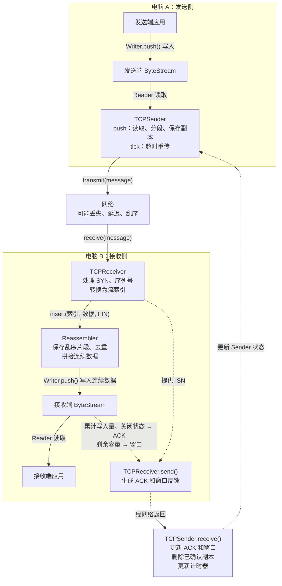

# TCP
## 一些名词的定义
| 术语 | 含义 |
|---|---|
| 字节流（byte stream） | 按顺序读取的一串字节；不保留应用写入时的分段边界，其实是一种数据抽象 |
| 报文段（segment） | TCP 一次传递的载荷及控制信息，具体包括序列号，控制标志，载荷等信息 。TCP 报文段： [ TCP 头部 + TCP 载荷 ]|
| 未确认报文（outstanding segment） | 已发送、尚未得到完整确认、需要保留以便重传的报文 |
|ISN|SYN使用的初始序列号|
|seqno|报文携带的32位序列号|
|n|以 SYN 为 0 的累计序号，不在$2^{32}$处回绕，代码中写成absolute_seqno|
|i|数据在字节流中的索引，第一个数据字节 i = 0，代码中写为stream_seqno|
|ackno|接收端期待的下一个序列号，以 32 位形式发送|
| 窗口（window） | 接收端当前允许发送端使用的序列号范围 |
| RTT （往返时间）| 发送到对应反馈到达的往返时间 |
| RTO （重传超时时间）| 计时器到期前允许等待的时间长度 |
## 核心流程 

## ByteStream
**为什么需要ByteStream？**
如果两个不同的程序，他们分别产生，取走数据，但是他们的工作速度可能不一样，中间就需要一个**暂存区**（其实这个设计理念和cache和磁盘很像）

生成数据的部件调用writer().push(message)
bytestream缓存尚未被取走的字节
消费数据的部件调用reader().peek()/pop(len)

需要注意的是bytestream管理的是按照顺序写入，取走的字节以及字节的状态，而重排乱序片段等工作由reassembler完成。
按照这种特点，不难想到可以bytestream类内部可以用**队列管理字节流**，把这个字节流记录为`std::deque<std::string> chunks_ {};`

在具体进入函数的实现细节前我想先吐槽一下，我一开始看byte_stream.hh的时候想不明白为什么reader和writer这两个不同的类，实例化后的对象怎么就能共享一块存储成员变量的内存？虽然说他们都继承了byte_stream后来看到byte_stream_helpers.cc对Reader& ByteStream::reader()和writer()的实现后,发现使用了对同一个ByteStream对象的向下转型，好吧。

但是为什么不能让reader和writer引用同一个bytestream对象呢？这样不是更加直观？
类似
```cpp
class Writer {
  ByteStream& stream_; // 指向要操作的流
};

class Reader {
  ByteStream& stream_; // 指向同一个流
};
```
Writer 对象 ──引用──┐
                   ├──→ ByteStream 对象：保存数据与状态
Reader 对象 ──引用──┘

吐槽完了，来讲下具体是如何实现push,peek,pop的。如果我需要push新的数据，首先必须知道现在ByteStream 对象还有多少可用容量，那么就要记录已经加载进来，还没被读取的字节数量。具体的计算公式如下
```cpp
bytes_buffered=bytes_pushed_-bytes_popped_;
available_capacity=capacity_-bytes_buffered;
```
那这就意味着我们在push,pop的时候必须这两个不变量，更新bytes_pushed_和bytes_popped_

另外这里还有一个比较重要，我认为也是这个bytestream类中最精彩的设计————front_offset游标，这个变量记录的是当前队列第一个元素已经被读取了多少个字节，负责记录读取进度。每当我想要peek现在能读取的字符串，我只需要返回`view.substr(front_offset_);
`其中view等于`string_view{chunks_.front()}`。更重要的是pop时会先检查`front_offset_== chunks_.front().size()`如果相等，就是说完全读取完第一个字符串才会chunks.pop_front()避免了频繁chunks.front.erase()带来的性能开销（毕竟要把留下来的字符串重新复制一遍）

一开始我有点搞不懂为什么要设计peek()，为什么就不能直接pop(len),觉得peek有点鸡肋？但是发现如果直接pop的话可能会丢失没有被socker真正写入的数据
```
auto view = reader.peek();          // string_view，不复制字符
size_t len = socket.write(view);   // 实际接受了多少字节
reader.pop(len);                   // 移除对应字节
```
先查看可以接受的字符串，再根据实际的接受量来移除，是更好的方式
## Reassembler
ByteStream 按写入顺序保存数据，但网络可能把原本的数据乱序送来，所以需要reassembler暂存乱序数据，处理重叠数据，保证只写入从当前位置开始的连续数据到bytestream

对于蓝色区域，这是已经被bytestream popped的字节流，
而绿色区域是已经被重排好的，还缓存在bytestream中的字节流，
红色区域是reassembler需要处理的，存在重叠，缺失的片段

只有出现了第一个从first_unassembled_index开始的连续片段reassembler才能向bytestream push数据，否则视为存在缺失片段

具体来讲，
```cpp
const uint64_t unassembled = writer.bytes_pushed();
  const uint64_t unaccetable = unassembled + writer.available_capacity();
  uint64_t accepted_begin = max( first_index, unassembled );//新片段经过容量裁剪后的起点
  uint64_t accepted_end = min( unaccetable, original_end ); // 注意这个边界去不到
```
accepted_begin和accepted_end共同规定了一个滑动窗口，代表当前insert可以放置data的区域

目标是只保存新片段中尚未保存的字节。同一个流索引不能重复计入 pending_。pending_是按片段起点排序的一个键值对的集合（其实就是`std::map<uint64_t, std::string>`）已有片段不能重叠!

变量**`scan_position`**用于记录新片段中尚未处理的第一个位置，
每轮扫描后，**新片段位于scan_position之前的部分都已经处理完毕（要么已有，要么刚刚保存了）**，这是核心的不变量。
it指向正在检查的已有片段

流程是这样的：
```txt
找到第一个可能重叠的已有片段
    ↓
if 已有片段前有空隙 → 保存空隙中的新字节
    ↓
已有片段覆盖的部分 → 跳过
    ↓
继续扫描下一个已有片段
    ↓
保存最后未覆盖的尾部
```
这里需要注意的是，第一个重叠的已有片段可能在新片段之前，也可能在新片段之后，找到当前片段后的第一个已有片段后，还需要检查已有片段前一个片段是否和新片段重叠，这么说可能有点抽象，可以看代码：
```cpp
    uint64_t scan_position = accepted_begin;
    auto it = pending_.lower_bound( scan_position );
    if ( it != pending_.begin() ) {
      auto previous = prev( it );
      uint64_t previous_end = previous->first + previous->second.size();
      if ( previous_end > accepted_begin ) { // 判断是否与上一个字符串存在重合
        it = previous;
      }
    }
```
然后就是如果有从writer.bytes_pushed()开始的片段，就马上push到chunks_中，如果写到了流的结束位置就关闭writer
## TCP Receiver && Sender
### TCP Receiver
#### wrap32
在进入具体的receive和send之前，还得实现wrap32类wrap和unwrap

wrap很简单，已知绝对序列号n,也知道ISN,只需要将两者相加并回绕，保证是32位无符号整数就行
```txt
seqno = (zero_point + n) mod 2^32
```
unwrap稍微复杂一点，先计算
```cpp
uint32_t offset = raw_value_ - zero_point.raw_value_;//其实就是offset=seqno-ISN
```
但是由于之前我们是通过32位回绕得到的seqno,所以我们得到的offset并不能代表真实的索引，或者说n

举个例子：
```txt
zero_point = 100
seqno = 103
offset = 3
```
那原来的n可能是：
```txt
3
3 + M
3 + 2M
3 + 3M
……
```
这里的M代表$2^{32}$
所以unwrap无法唯一还原原来的n,必须用checkpoint作为参考来选择距离checkpoint最近的那个候选值

这里用bytes_pushed+1作为参考checkpoint,加1是因为SYN占用一个序列号。

```cpp
uint64_t round = checkpoint / M;
```
```txt
前一圈： (round - 1) × M + offset
当前圈： round × M + offset
后一圈： (round + 1) × M + offset
```
对比哪一个和checkpoint最近，如果前一圈、后一圈不存在或超过uint64_t范围时不检查。
#### receive&&send
reassembler要求的输入是：
```cpp
insert(流索引, 数据, 是否为最后一段);
```
但是网络传给receiver的信息是seqno、SYN、payload、FIN，所以receiver的核心任务就是将这两种表达翻译并连接
核心的流程如下：
```txt
收到报文
   ↓
处理 RST；用 SYN 确定 ISN
   ↓
unwrap：seqno → 绝对序列号 n
   ↓
把 payload 的位置转换成流索引 i
   ↓
Reassembler::insert()
   ↓
连续数据进入 ByteStream
```
代码中唯一需要注意的就是如果在已经接受了ISN，新报文又提供了ISN,此时还是使用旧的ISN。如果还没有收到ISN就暂时丢弃报文

send本质上是构造一个报文通知TCPsender端字节流状态，窗口，以及期待的下一个字节流序号（next_absolute_seqno），其实这个就是通知sender已经拼齐写入了bytestream多少字节，在sender的代码中写为acked_abs_
### TCP Sender
sender的核心作用：push从bytestream读取数据，保留未确认副本，发送报文；receive收到ACK后释放副本，更新窗口；超时重传。

```cpp
uint64_t acked_abs_; // 已确认边界
uint64_t next_abs_;  // 下一次发送新内容的位置
```
注意这两个都是绝对序列号，我的理解是acked_abs_是由接收端决定，而next_abs_是只要发送端发出了就能推进的，记录到目前为止sender发送了多少字节

直观来看是：
|0 到acked_abs_|acked_abs_到next_abs_|next_abs_以及之后|
|---|---|---|
|已经确认            |     已发但未确认     |尚未发送|

push()的基本思路是计算可用空间，组装报文，保存副本，最后发送。

这里的可用空间本质上是由bytestream的available_capacity决定的，而不是receiver的map或者reassembler的deque。
这里需要注意的是计算available_space时，必须先比较next_abs_ - acked_abs_和effective_window，再将两者相减否则会出现无符号下溢。
```cpp
void TCPSender::push( const TransmitFunction& transmit )
{
//-----计算空间------
  uint64_t effective_window = max<uint64_t>( window_size_, 1 );
  while ( true ) {//持续发送message直到可用空间被用尽
    if ( next_abs_ - acked_abs_ >= effective_window ) { // 避免无符号下溢
      break;
    }
    uint64_t available_space = effective_window - ( next_abs_ - acked_abs_ ); // 本轮可以占用多少个序列号
    //------组装报文------
    TCPSenderMessage message = make_empty_message();
    if ( !syn_sent_ && available_space ) {
      message.SYN = 1;
      syn_sent_ = 1;
      available_space--;
    }//添加SYN

    uint64_t payload_size = min<uint64_t>( available_space, TCPConfig::MAX_PAYLOAD_SIZE );
    read( reader(), payload_size, message.payload );
    available_space -= message.payload.size();//如果还有空间就读取bytestream的缓存字节并放置在payload
    if ( reader().is_finished() && !fin_sent_ && available_space > 0 ) {
      message.FIN = true;
      fin_sent_ = true;
      available_space--;
    }//添加FIN
    if ( message.sequence_length() == 0 ) {
      break;
    }
    //-----保存副本-----
    const bool timer_was_stopped = sent_but_unacked_.empty();
    sent_but_unacked_.push_back( { next_abs_, message } );
    next_abs_ += message.sequence_length();
//-----发送报文------
    transmit( message );

    if ( timer_was_stopped ) {
      elapsed_ms_ = 0;
    }
  }
}
```
receive也是同理，根据传递的报文更新窗口，acked_abs_，删除副本，重置时间。

这里我当时做的时候有点疑惑的是为什么当有新的内容被确认，就能重置elapsed_ms_,明明这个elapsed_ms_不一定是这个被确认的新报文的传输时间？事实确实如此，elapsed_ms_记录的时间不一定是真正被TCPreceiver接受的时间，而是从acked_abs开始，能够连续的最大字节流被bytestream确认需要的时间。
而新的ACK到来就意味着这一段连续的字节流都被确认了，自然可以重置重传状态和推进acked_abs_

```cpp
void TCPSender::receive( const TCPReceiverMessage& msg )
{
  if ( msg.RST ) {
    input_.set_error();
  }

  window_size_ = msg.window_size;

  if ( !msg.ackno.has_value() ) {
    return;
  }
  const uint64_t ack_abs = msg.ackno.value().unwrap( isn_, next_abs_ );

  // 超过 next_abs_：不可能的 ACK
  if ( ack_abs > next_abs_ ) {
    return;
  }

  // 小于或等于当前确认边界：旧 ACK 或重复 ACK
  if ( ack_abs <= acked_abs_ ) {
    return;
  }
  // 到这里说明 ACK 确认了新内容
  acked_abs_ = ack_abs;

  //删除已被完整确认的队首报文
  while(!sent_but_unacked_.empty()){
    uint64_t end_abs=sent_but_unacked_.front().begin_abs+sent_but_unacked_.front().message.sequence_length();
    if(end_abs<=acked_abs_){
    sent_but_unacked_.pop_front();
    }
    else{
      break;
    }
  }
  // 新 ACK 到来，重置重传状态
  elapsed_ms_ = 0;
  current_RTO_ms_ = initial_RTO_ms_;
  consecutive_retx_ = 0;
}
```
tick用于实时更新elapsed_ms_，如果达到了重传时间，就需要重传。如果还有空间，就增加重传次数，并将重传时间变为原来的两倍，减少越来越拥堵的网络的压力。
```cpp
void TCPSender::tick( uint64_t ms_since_last_tick, const TransmitFunction& transmit )
{
  if(sent_but_unacked_.empty()){
    return;
  }
  elapsed_ms_+=ms_since_last_tick;
  if(elapsed_ms_<current_RTO_ms_){
    return;
  }
  transmit(sent_but_unacked_.front().message);
  if(window_size_>0){
    consecutive_retx_++;
    current_RTO_ms_*=2;
  }
  elapsed_ms_=0;
}
```


  


