# 多源最短路径
## 图的基本表示方法
邻接矩阵
$$
w_{ij}=w(i,j),i \neq j,(i,j)\in E
$$
$$
w_{ij}=0,i=j
$$
$$
w_{ij}=\infty,i \neq j,(i,j)\notin E
$$
### 前驱子图
* $\pi_{ij}$代表从源结点$i$到目标结点$j$路径上最后经过的一个结点
可以理解为$j$的直接父节点
* $\Pi$是一个大小为$V^{2}$的矩阵记录了所有的$\pi_{ij}$，其中第$i$行记录了以$i$为源点时，所有点的前驱结点，而这一行诱导出的子图就是以$i$为根的最短路径树，也叫做结点$i$的前驱子图$G_{\pi,i}$
* $G_{\pi,i}$代表一棵以$i$为根结点的最短路径树，具体可以写为$G_{\pi,i}=(V_{\pi,i},E_{\pi,i})$
其中有
$$
V_{\pi,i}=\{j\in V:\pi_{ij}\neq NIL\}\cup\{i\}
$$
$$
E_{\pi,i}=\{(\pi_{ij},j):j\in V_{\pi,i}-\{i\}\}
$$
```cpp
print_all_pairs_shortest_path(PI,i,j)
if i==j
    print i
else if pi_{ij}==NIL
    print"no path from"i"to"j"exits"
else print_all_pairs_shortest_path(PI,i,pi_{ij})
    print j
```
```cpp
void printPath(const vector<vector<int>>& pi, int i, int j) {
    if (i==j) {
        cout << i;
    } 
    else if (pi[i][j]==-1) {
        cout << "no path from " << i << " to " << j << " exists";
    } 
    else {
        printPath(pi, i, pi[i][j]);
        cout << " -> " << j;
    }
}
```
这个打印父节点的算法后面会被extend-shortest-paths和Floyd-Warshall用到，作用是还原每条最短路径
## 使用V次Dijkstra算法
在学习完单源最短路径后，我们很容易想出用$|V|$次单源最短路径算法来求出所有结点对之间的最短路径，每一次使用不同的结点作为源结点。如果所有的权重为非负值，那么就可以使用Dijkstra，此时算法的时间复杂度为**单次Dijkstra的代价$\times|V|$**
### 使用线形数组实现最小优先队列
* 单次Dijkstra时间复杂度为$O(V^{2}+E)$
    *  $O(V^{2})$来自每次从未处理的节点中线形扫描找到最小值（每次至多扫描$|V|$个节点，一共处理$|V|$次）
    * $O(E)来自遍历所有边进行松弛$
* V次总时间为$O(V^{3}+VE)=O(V^{3})$其中$VE \leq V \times V^{2}=V^{3}$
### 使用二叉堆实现最小优先队列
* 单次Dijkstra时间复杂度为$O((V+E)lgV)$
  * 每次从堆中弹出最小元素:$O(lgV)$，共$V$次
  * 每次更新节点的距离(decrease-key):$O(lgV)$,共$E$次
* V次总时间为$O(V^{2}lgV+VElgV)$
  * 其中因为$E \geq V-1$,$VElgV$为主导项，所以最后可以被简化为$O(VElgV)$
### 使用斐波那契堆实现最小优先队列
* 单次Dijkstra时间复杂度为$O(VlgV+E)$
  * extract-min:$O(lgV)$,一共$V$次->$O(VlgV)$
  * decrease-key:摊还时间$O(1)$,一共$E$次->$O(E)$
* V次总时间为$O(V^{2}lgV+VE)$
## extend-shortest-paths
### 最短路径具有最优子结构
假定从$i$到$j$有一条最短路径$p$,$p$最多包含$m$条边
如果起点$i$和$j$不相同，且有$j$的前驱结点$k$，则最短路径可以被拆解为$\delta(i,j)=\delta(i,k)+w_{kj}$
其中从$i$到$k$至多包含$m-1$条边

注意，此时我们认为$k$是最短路径上$j$的前驱结点，可是我们一开始并不知道最短路径是那一条，所以对于$j$所有可能前驱$k$我们都需要进行检查来获得$l_{ij}^{(m)}$
我们可以得到：
$$
l_{ij}^{(m)}=min(l_{ij}^{(m-1)},\min\limits_{1\le k \le n}\{l_{ik}^{(m-1)}+w_{kj}\})=\min\limits_{1\le k \le n}\{l_{ik}^{(m-1)}+w_{kj}\}
$$
注意$k$是可以取到$j$的也就是说此时
$$
l_{ik}^{(m-1)}+w_{kj}=l_{ij}^{(m-1)}
$$
第二个等式自然成立
需要注意的是如果一共有$n$个结点，那么从$i$到$j$的简单路径上的边最多有$n-1$条，否则就会成环，只要这个环上的权重和不为负数，我们都可以通过删除这个环从而获得更小或者相等的路径权重和，因此，从$i$到$j$的多于$n-1$条边构成的路径不可能有比从$i$到$j$的最小路径权重更小的权重和
$$
\delta(i,j)=l_{ik}^{(n-1)}=l_{ik}^{(n)}=l_{ik}^{(n+1)}=...
$$
### 伪代码(只涉及$L$和上一轮$L'$的递推关系，至于怎么快速求得$L^{(n-1)}$需要用重复平方)
```cpp
extend_shortest_paths(L,W)
n=L.rows
let L'=(L_{ij}')be a new n*n matrix
for i=1 to n
    for j=1 to n
        l_{ij}'=infinite
        for k=1 to n
            l_{ij}'=min(l_{ij}',l_{ik}+w_{kj})
    
```
不难看出算法的时间复杂度为$O(n^{3})$
对于矩阵乘法有：
$C=A \times B$
$A,B$都是$n\times n$的方阵
$c_{ij}=\sum\limits_{k=1}^{n}a_{ik}\cdot b_{kj}$
书上的算法：
$l_{ij}^{(m)}=\min\limits_{1\le k \le n}\{l_{ik}^{(m-1)}+w_{kj}\}$
书上也提到这种算法和矩阵乘法很像，对于这个算法里进行的所有运算都可以一一映射到矩阵乘法中的运算：

$ l^{m-1} \to a $

$ w\to b$

$ l^{m} \to c$

$min \to +$

$ + \to \cdot $

那这是不是意味着这种算法也满足矩阵乘法的一些基本定律呢？
比如说结合律？
答案是这种算法也满足结合律，有了这条性质，加上我们之前已经验证过的性质
$$
\delta(i,j)=l_{ik}^{(n-1)}=l_{ik}^{(n)}=l_{ik}^{(n+1)}=...
$$
使得我们可以利用**重复平方**来加速计算
定义 $\otimes\ $为 min-plus 矩阵乘法：
$$
(L \otimes W)_{ij} = \min\limits_{1 \le k \le n}( L_{ik} + W_{kj})
$$
$$
L^{(1)}=L^{(0)}\otimes W=W
$$
$$
L^{(2)}=L^{(1)}\otimes W=W^{2}
$$
$$
···
$$
$$
L^{(n-1)}=L^{(n-2)} \otimes W=W^{n-1}
$$
对于**重复平方**：
$$
L^{(2m)}=L^{(m)} \otimes L^{(m)}=W^{2m}
$$
当$2m > n-1$时$L^{(2m)} = L^{(n-1)}$
最少经过$\lceil log_{2}^{n-1} \rceil$次平方达到$L^{(n-1)}$
### 伪代码(没有重复平方版)
```cpp
slow_all_pairs_shortest_paths(W)
n=W.rows
L^{(1)}=W
for m=2 to n-1
    let L_{(m)}be a new n*n matrix
    L^{(m)}=extend_shortest_paths(L^{(m-1)},W)
return L^{(n-1)}
```
时间复杂度：$O(n^{4})$
### 伪代码(重复平方优化)
```cpp
faster_all_pairs_shortest_paths(W)
n=W.rows
L^{(1)}=W
m=1
while m<n-1
    let L^{(2m)} be a new n*n matrix
    L^{(2m)}=extend_shortest_paths(L^{(m)},L^{(m)})
    m=2m
return L^{(m)}
```
时间复杂度：$O(\lceil log_{2}^{n-1} \rceil \cdot n^{3})$
一些不太重要的想法：为什么是平方？
因为min-plus矩阵乘法一次性只能处理两个矩阵
### cpp代码实现
```cpp
#include<iostream>
#include<vector>
#include<climits>
#include<sstream>
using namespace std;

const int INF = INT_MAX;

vector<vector<int>> extend_shortest_paths(const vector<vector<int>>& L1,const vector<vector<int>>& L2,vector<vector<int>> &P){
    int n = L2.size();
    vector<vector<int>> L_new (L1) ;
    for(int i=0;i<n;i++){
        for(int j=0;j<n;j++){
            for(int k=0;k<n;k++){
                if(L1[i][k]!=INF && L2[k][j]!=INF){
                    if(L_new[i][j] > L1[i][k] + L2[k][j]){
                        L_new[i][j] = L1[i][k] + L2[k][j];//不可以原地修改，L_new依赖上一轮的L[i][k]，也就是说i,j之间的最小权重和还会再变
                        P[i][j]=P[k][j];//注意不要直接写成k,因为k可能不是直接j的前驱结点
                    }
                }
            }
        }
    }
    return L_new;
}

vector<vector<int>> slow_all_shortest_paths(const vector<vector<int>>& W,vector<vector<int>>&P){
    int n = W.size();
    vector<vector<int>> L = W;
    int m=1;
    while(m<n-1){
        L=extend_shortest_paths(L,L,P);
        m=2*m;
    }
    return L;
}

void printPath(const vector<vector<int>>& pi, int i, int j) {
    if (i==j) {
        cout << i;
    } 
    else if (pi[i][j]==-1) {
        cout << "no path from " << i << " to " << j << " exists";
    } 
    else {
        printPath(pi, i, pi[i][j]);
        cout << " -> " << j;
    }
}
int main(){
    int n;
    if(!(cin>>n)) return 0;
    cin.ignore();

    int u,v,w;
    string line;
    vector<vector<int>> W(n, vector<int>(n, INF));

    for(int t=0;t<n;t++){
        W[t][t] = 0;
    }

    while(getline(cin,line)){
        if(line.empty()) break;
        stringstream ss(line);
        while(ss>>u>>v>>w){
            W[u][v] = w;
        }
    }

    vector<vector<int>> P (n,vector<int>(n,-1));
    for (int i=0;i<n;i++) {
        for (int j=0;j<n;j++) {
            if (i!=j && W[i][j]!=INF) {
                P[i][j]=i;
            }
        }
    }

    vector<vector<int>> L = slow_all_shortest_paths(W,P);

    for(int i=0;i<n;i++){
        for(int j=0;j<n;j++){
            if(L[i][j]==INF) cout<<"I"<<" ";
            else cout<<L[i][j]<<" ";
        }
        cout<<endl;
    }
    cout<<endl;
    for(int i=0;i<n;i++){
        for(int j=0;j<n;j++){
            if(P[i][j]==INF) cout<<"I"<<" ";
            else cout<<P[i][j]<<" ";
        }
        cout<<endl;
    }
    cout<<endl;
    printPath(P,0,n-1);
    
}
```
需要注意的是，在重复平方中由于我们使用的是$L\otimes L$,而非$L \otimes W$,此时$L[k][j]$不是像$W[k][j]$一样的单步边权，而是从$k$到$j$的最短路径长度，所以可能经过多个中间结点，**在更新$j$的直接前驱结点时，不能写$k$,而需要写成$P[k][j]$**
## Floyd-Warshall 算法
与考虑最多需要多少步可以到达的extend-shortest-paths不同，Floyd-Warshall 考虑的是一条最短路径上的**中间结点**
### 最短路径的结构
假定图$G$的所有结点为$V=\{1,2,...,n\}$，其中的一个子集$\{1,2,...,k\}$,这里的$k$是某个小于$n$的整数。对于任意结点对$i,j \in V$,考虑从结点$i$到$j$所有中间结点都取自集合$\{1,2,...,k\}$的路径，并设$p$为其中权重最小的简单路径。下面给出最短路径$p$和$k$的关系
* 如果结点$k$不是路径$p$上的中间结点，则路径$p$上的所有中间结点都属于集合$\{1,2,...,k-1\}$。因此，从结点$i$到$j$的中间结点取自$\{1,2,...,k-1\}$的一条最短路径也是从结点$i$到$j$的中间结点取自$\{1,2,...,k\}$的一条最短路径
* 如果结点$k$是路径$p$上的中间结点，则可以将路径$p$分解为从$i$到$k$的最短路径$p1$,和从$k$到$j$的最短路径$p2$,其中$p1$和$p2$的所有中间结点都取自$\{1,2,...,k-1\}$（如果$p1$或者$p2$上还有中间结点$k$的话，就会形成一个环，在我们默认不存在权重和为负值的环的前提下，我们可以通过删除环使得路径上的权重和减小，但是这与$p1$和$p2$已经是最短路径的前提矛盾，所以中间结点不可能出现$k$）

若写成公式的话可以有：
$$
d_{ij}^{(k)} = 
\begin{cases} 
w_{ij}, & \text{if } k = 0 \\[4pt]
\min\left(d_{ij}^{(k-1)}, \; d_{ik}^{(k-1)} + d_{kj}^{(k-1)}\right), & \text{if } k \ge 1 
\end{cases}
$$
因为对于所有路径来说，所有的中间结点都属于集合$\{1,2,...,n\}$，所以矩阵$D^{(n)}=(d_{ij}^{(n)})$就是我们需要求出的最后答案
### 伪代码
```cpp
floyd-warshall(W)
n=W.rows
D^(0)=W
for k=1 to n
    let D^{(k)}be a new n*n matrix
    for i=1 to n
        for j=1 to n
            d_{ij}^{(k)}=min(d_{ij}^(k-1),d_{ik}^{(k-1)}+d_{kj}^{(k-1)})
return D^{(n)}
```
### cpp代码实现
```cpp
#include<iostream>
#include<vector>
#include<sstream>
#include<climits>
#include<algorithm>
using namespace std;
void printPath(const vector<vector<int>>& pi, int i, int j) {
    if (i==j) {
        cout << i;
    } 
    else if (pi[i][j]==-1) {
        cout << "no path from " << i << " to " << j << " exists";
    } 
    else {
        printPath(pi, i, pi[i][j]);
        cout << " -> " << j;
    }
}
vector<vector<int>> floyd_warshall(const vector<vector<int>>& W,vector<vector<int>>&P){
    int n=W.size();
    vector<vector<int>>D(W);//通过0个中间结点到达需要的通过的距离
    for(int k=0;k<n;k++){//中间结点可取0,1,2,3...k
        for(int i=0;i<n;i++){
            for(int j=0;j<n;j++){
                if(D[i][k]!=INT_MAX && D[k][j]!=INT_MAX){
                    if(D[i][j]>D[i][k]+D[k][j]){
                        D[i][j]=D[i][k]+D[k][j];
                        /*
                        可以原地修改，因为对于当前k而言，
                        本轮循环的目的是求出中间结点为1,2...k的最短路径
                        所以D[i][k]和D[k][j]不会在本轮中被修改
                        (不可能存在以i为起点k为终点,
                        同时以k作为中间结点的更短路径
                        ,因为这样就成环了,
                        同理也不可能存在
                        以k为起点j为终点
                        的更短路径)
                        */
                        P[i][j]=P[k][j];
                    }
                }
            }
        }
    }
    return D;
}
int main(){
    int n;
    if(!(cin>>n)) return 0;
    cin.ignore();
    int u,v,w;
    string line;
    vector<vector<int>> W(n, vector<int>(n, INT_MAX));
    for(int t=0;t<n;t++){
        W[t][t] = 0;
    }
    while(getline(cin,line)){
        if(line.empty()) break;
        stringstream ss(line);
        while(ss>>u>>v>>w){
            W[u][v] = w;
        }
    }

    vector<vector<int>> P (n,vector<int>(n,-1));
    for (int i=0;i<n;i++) {
        for (int j=0;j<n;j++) {
            if (i!=j && W[i][j]!=INT_MAX) {
                P[i][j]=i;
            }
        }
    }

    vector<vector<int>> D = floyd_warshall(W,P);
    for(int i=0;i<n;i++){
        for(int j=0;j<n;j++){
            if(D[i][j]==INT_MAX) cout<<"I"<<" ";
            else cout<<D[i][j]<<" ";
        }
        cout<<endl;
    }
    cout<<endl;
    for(int i=0;i<n;i++){
        for(int j=0;j<n;j++){
            if(P[i][j]==INT_MAX) cout<<"I"<<" ";
            else cout<<P[i][j]<<" ";
        }
        cout<<endl;
    }
    cout<<endl;
    printPath(P,0,n-1);
}
```
不难看出这个算法的时间复杂度由三层嵌套循环决定，所以为$\Theta(n^{3})$
在构建矩阵$D^{(k)}$的同时，我们还需要维护前驱结点矩阵$\Pi^{(k)}$,对于每个结点对$i,j$有：
$$
\pi_{ij}^{(k)} = 
\begin{cases} 
\pi_{ij}^{(k-1)}, & \text{if } d_{ij}^{(k-1)} \le d_{ik}^{(k-1)} + d_{kj}^{(k-1)} \\[4pt]
\pi_{kj}^{(k-1)}, & \text{if } d_{ij}^{(k-1)} > d_{ik}^{(k-1)} + d_{kj}^{(k-1)}
\end{cases}
$$
### 有向图的闭包传递
我们希望判断在有向图$G$中是否又一条从$i$到$j$的路径
* 利用floyd-warshall算法
  * 将$E$中的每条边赋予权重1，然后运行floyd-warshall算法。如果存在一条从$i$到$j$的路径，则有$d_{ij}<n$;否则$d_{ij}=\infty$，时间复杂度为$O(n^{3})$
* 通过逻辑与和逻辑或代替floyd-warshall算法中$min$和$+$操作
  * 我们定义如果有向图$G$中是否又一条从$i$到$j$的路径，且所有中间结点都取自集合$\{1,2,...,k\}$
    则$t_{ij}^{(n)}=1$,否则$t_{ij}^{(n)}=0$
    对于$k\geq 1$:
    $$
    t_{ij}^{(k)}=t_{ij}^{(k-1)}\lor(t_{ik}^{(k-1)}\land t_{kj}^{(k-1)})
    $$
    该算法的时间复杂度同floyd-warshall
#### cpp实现
```cpp
#include<iostream>
#include<vector>
#include<sstream>
using namespace std;
vector<vector<bool>> floyd_warshall(const vector<vector<bool>>& E){
    int n=E.size();
    vector<vector<bool>>T(E);
    for(int k=0;k<n;k++){
        for(int i=0;i<n;i++){
            for(int j=0;j<n;j++){
                T[i][j]=T[i][j]||(T[i][k]&&T[k][j]);
            }
        }
    }
    return T;
}
int main(){
    int n;
    if(!(cin>>n)) return 0;
    cin.ignore();
    int u,v;
    string line;
    vector<vector<bool>> E(n, vector<bool>(n, 0));//两个结点有边相连就为1，否则为0
    for(int t=0;t<n;t++){
        E[t][t] = 1;
    }
    while(getline(cin,line)){
        if(line.empty()) break;
        stringstream ss(line);
        while(ss>>u>>v){
            E[u][v] = 1;
        }
    }

    vector<vector<bool>> T = floyd_warshall(E);
    for(int i=0;i<n;i++){
        for(int j=0;j<n;j++){
            cout<<T[i][j]<<" ";
        }
        cout<<endl;
    }
}
```
## 用于稀疏图的Johnson算法
Johnson算法可以在$O(V^{2}lgV+VE)$时间内找到所有结点对之间的最短路径（和之前说过的$V$次用斐波那契堆排序的Dijkstra算法代价相同）。对于稀疏图来说$E$渐进于$V-1$,所以Johnson的渐进表现优于重复平方法和Floyd-Warshall。Johnson算法使用Dijkstra和Bellman-Ford作为自己的子程序，所以Johnson算法要么返回一个包含所有结点对的最短路径权重的矩阵，要么报告输入图包含一个权重为负值的环路

一般对图来说，像Bellman-Ford一样暴力地遍历$V-1$次边集是不太划算的，因此我们更希望采用更高效的Dijkstra算法，但是Dijkstra无法处理含有权重为负的边的图，所以，Johnson算法通过重新赋予权重，使得所有边权重$w$都为非负值，这样我们就可以通过对每个结点运行一次Dijkstra来找到所有结点对之间的最短路径，我们设$\hat{w}$为新赋予的权重，这个权重必须满足下面**两个重要性质**：
**1. 对于所有的结点对$u,v\in V$，一条路径$p$是在使用权重函数$w$时从$u$到$v$的一条最短路径当且仅当$p$是在使用权重函数$\hat{w}$时从$u$到$v$的一条最短路径
2. 对于所有的边$(u,v)$,新权重$\hat{w}(u,v)$非负**
### 证明性质一
那么，下面展示我们具体是如何重新赋予权重的：
我们使用$\delta$表示从权重函数$w$所导出的最短路径权重，而用$\hat{\delta}$表示权重函数$\hat{w}$所导出的最短路径权重
> 定义$\hat{w}(u,v)=w(u,v)+h(u)-h(v)$
> 设$p=<v_{0},v_{1},...,v_{k}>$是在使用权重函数$w$时从结点$v_{0}$到$v_{k}$的一条最短路径当且仅当$p$是在使用$\hat{w}$时从结点$v_{0}$到$v_{k}$的一条最短路径
> 在使用权重函数$w$不包含权重为负值的环路，当且仅当$p$在使用$\hat{w}$时不包括权重为负值的环路

下证：
$$
\hat{w}(p)=w(p)+h(v_{0})-h(v_{k})
$$
$$
\hat{w}(p) = \sum_{i=1}^k \hat{w}(v_{i-1}, v_i) 
$$
$$
= \sum_{i=1}^k \bigl( w(v_{i-1}, v_i) + h(v_{i-1}) - h(v_i) \bigr)
$$
$$
= \sum_{i=1}^k w(v_{i-1}, v_i) + h(v_0) - h(v_k) \qquad (\text{裂项相消})
$$
$$
= w(p) + h(v_0) - h(v_k)
$$
由于$h(v_0) ,h(v_k)$不依赖于任何具体的路径，所以从结点$v_{0}$到$v_{k}$的一条路径在使用权重函数$w$时比另一条路径短，则其在使用$\hat{w}$时也比另一条路径短（你可以理解为现在和原先的权重和相比只相差了一个常数，但是不同路径的权重和的相对关系依然不变）
**所以 $w(p)=\delta(v_0,v_k)$当且仅当$\hat{w}(p)=\delta(v_0,v_k)$**
最后我们还需要证明在使用权重函数$w$包含权重为负值的环路，当且仅当$p$在使用$\hat{w}$时包括权重为负值的环路。考虑任意环路$c=<v_{0},v_{1},...,v_{k}>$,其中$v_0=v_k$,所以$\hat{w}(c)=w(c)+h(v_0)-h(v_k)=w(c)$,因为$w(c)\leq 0$所以$\hat{w}(c)\leq 0$,证毕
### 证明性质二
我们定义对于所有的结点$v\in V'$,$h(v)=\delta(s,v)$由三角不等式可知$
h(v)\leq h(u)+w(u,v)$ , 因此 
$\hat{w}(u,v)=w(u,v)+h(u)-h(v)\geq 0$,满足性质二
### Johnson伪代码
```cpp
Johnson(G,w)
compute G',where G'.V=G.V and {s},G'.E=G.E and {(s,v):v in G.V},w(s,v)=0 for all v in G.V
if Bellman-Ford(G',w,s)==False
    print"the input graph contains a negative-weight cycle"
else for each vertex v in G'.V
    set h(v) to the value of delta(s,v)compute by the Bellman-Ford algorithm
    for each edge(u,v) in G'.V
        hat{w}(u,v)=w(u,v)+h(u)-h(v)
        let D=(d_{uv}) be a new n*n matrix
        for each vertex u in G.V
            run Dijkstra(G,hat{w},u) to compute hat{delta}(u,v) for all v in G.V
            for each vertex v in G.V
                d_{uv}=hat{delta}(u,v)+h(v)-h(u)
    return D
```
### cpp实现
```cpp
#include<vector>
#include<iostream>
#include<sstream>
#include<climits>
#include<queue>
using namespace std;
class Edge{
public:
    int u;
    int v;
    int weight;
public:
    Edge(int u, int v, int weight){
        this->u = u;
        this->v = v;
        this->weight = weight; 
    }
   
};
void Relax(Edge e,vector<int> & distance){
    if(distance[e.u]!=INT_MAX&&distance[e.v]>distance[e.u]+e.weight){
        distance[e.v]=distance[e.u]+e.weight;
    }
}
bool Bellman_ford(const vector<Edge>&edges,int V,vector<int>&distance){
for(int i=1;i<V;i++){
    for(Edge e:edges){
        Relax(e,distance);
    }
}
for(Edge e:edges){
    if(distance[e.v]>distance[e.u]+e.weight){
        return false;
    }
}
return true;
}//Bellman_ford用于计算h(u)
void Relax(int u,int v,int weight,vector<int> & distance){
    if(distance[u]!=INT_MAX&&distance[v]>distance[u]+weight){
        distance[v]=distance[u]+weight;
        
    }
}
struct compare
{
    bool operator()(const pair<int,int> &V1,const pair<int,int>&V2){
        return V1.first>V2.first;
    }
};

void Dijkstra(int s,const vector<vector<int>> & W,vector<int> & distance){
    int V=W.size();
    using P=pair<int,int>;//distance[u],u
    priority_queue<P,vector<P>,compare>Q;
    Q.push({0,s});
    while(!Q.empty())
    {   
        auto [d,u]=Q.top();
        Q.pop();
        if (d > distance[u]) continue;//旧记录无效时跳过，始终以 distance[u] 的最新值为准
        for(int v=0;v<V;v++){
            int w=W[u][v];//取出邻接结点的权重
            if(w==INT_MAX) continue;//防止溢出
            if(distance[v]>distance[u]+w){
                Relax(u,v,w,distance);
                Q.push({distance[v],v});
            }
        }
        //可以理解为Dijkstra返回的是新的distance数组,代表从源结点S到其他结点的最小距离和
    }
}
vector<vector<int>> Johnson(vector<Edge>&edges,int V){
    vector<int>h(V+1,INT_MAX);//因为加入了S结点，所以总共有V+1个结点
    h[V]=0;//指定源S为第V+1个结点，距离为0，其他则为INT_MAX；
    vector<Edge>new_edges_for_bellman(edges);
    for(int i=0;i<V;i++){
        new_edges_for_bellman.push_back(Edge(V,i,0));//加入V条与结点S相连的边
    }

    if(!Bellman_ford(new_edges_for_bellman,V+1,h)){
        throw "存在权重和为负值的环";
    }

    else{
        for(Edge &e:edges){
             e.weight=e.weight+(h[e.u]-h[e.v]);//改写权重，使得weight>=0
        }

        vector<vector<int>>W_new(V,vector<int>(V,INT_MAX));//初始化改写的权重矩阵,用于Dijkstra
        for(Edge e:edges){
           W_new[e.u][e.v]=e.weight;//改写用于表示边的数据结构，将边的集合改写为邻接权重矩阵
        }
        for(int i=0;i<V;i++){
            W_new[i][i]=0;
        }

        vector<vector<int>>D(V,vector<int>(V));//用于存储任意两结点对的最短距离

        for(int i=0;i<V;i++){
            vector<int>distance(V,INT_MAX);
            distance[i]=0;//以i为源结点的路径
            Dijkstra(i,W_new,distance);//distance代表以i为源结点的最小路径树
            for(int j=0;j<V;j++){
                if(distance[j]!=INT_MAX)D[i][j]=distance[j]+h[j]-h[i];//将路径权重和改写回来
                else D[i][j]=INT_MAX;//改写权重后不可到达的结点在原来没改写时也是不可到达的
            }
        }
        
        return D;
    }
}
int main(){
    int V;
    cin>>V;
    cin.ignore();
    vector<Edge>edges;//适应bellman的数据结构，在Johnson内部会改写为邻接矩阵，记录的是权重
    string line;
    int u,v,weight;
    while(getline(cin,line)){
        if(line.empty())break;
        stringstream ss(line);
        ss>>u>>v>>weight;
        edges.push_back(Edge(u,v,weight));
    }
    try{
        vector<vector<int>>D(Johnson(edges,V));
        for(int i=0;i<V;i++){
            for(int j=0;j<V;j++){
                if(D[i][j]==INT_MAX) cout<<"I"<<" ";
                else cout<<D[i][j]<<" ";
            }
            cout<<endl;
        }
    }
    catch(const char* e){
        cout<<*e<<endl;
    }
}
```
## 一些现代导航工具常用到的算法
### A*算法
虽然Dijkstra能高效得到单个源结点到剩余所有结点的最短路径，但是在实际生活中，我们用导航软件比如谷歌地图时，我们需要输入起点和终点，而此时导航软件只需要返回这两个结点之间的最短路径即可。但是，我们用Dijkstra求得这两点的最短路径前，会将非源结点都探索一遍，这显然是没必要的，举个例子：
> 如果说你现在在湖南，你想到北京，但是在Dijkstra运行过程中会向南探索到一条经过深圳的路径，这不是南辕北辙，越走越远吗

为了让我们的Dijkstra算法更加智能，我们需要引入一个函数$h$来引导Dijkstra选择结点，我们先通过$h$重新定义边权：
$$
\hat{w}(u,v)=w(u,v)+h(v)-h(u)
$$
一种对于函数$h$的有趣理解是它代表了一个结点的“势能”，因为我们从$u$“下山”，“势能”减少$h(u)$,随后我们从$v$又上山,“势能”增加$h(v)$
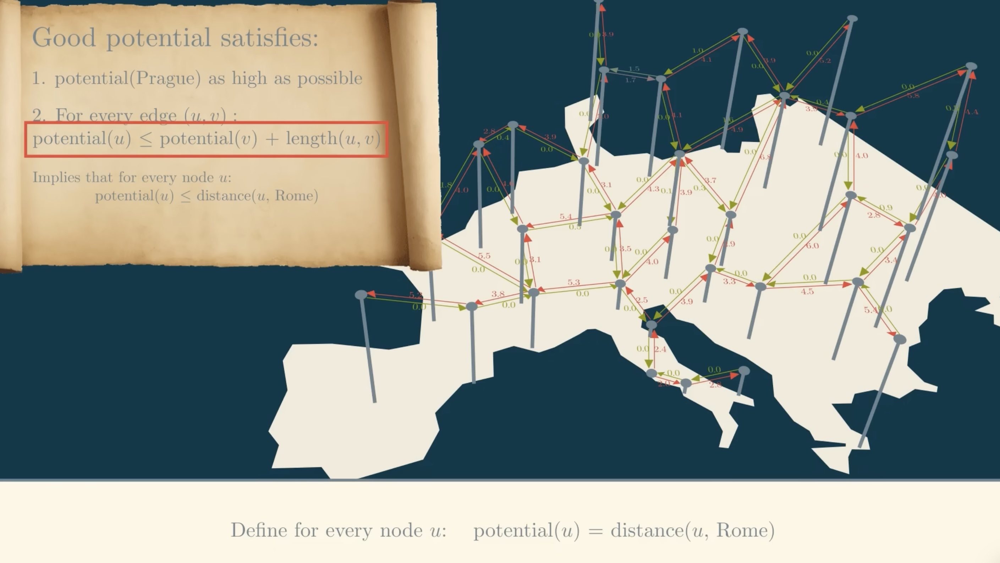
如果我们设一条路径$p=<v_{0},v_{1},...,v_{k}>$为$v_0$到$v_k$的一条最短路径，
$$
\hat{w}(p)=w(p)+h(v_{k})-h(v_{0})
$$
$$
\hat{w}(p) = \sum_{i=1}^k \hat{w}(v_{i-1}, v_i) 
$$
$$
= \sum_{i=1}^k \bigl( w(v_{i-1}, v_i) + h(v_{i}) - h(v_{i-1}) \bigr)
$$
$$
= \sum_{i=1}^k w(v_{i-1}, v_i) + h(v_k) - h(v_0) \qquad (\text{裂项相消})
$$
$$
= w(p) + h(v_k) - h(v_0)
$$
因为是最短路径所以有
$w(p)=\delta(v_0,v_k)$ ,$\hat{w}(p)=\hat{\delta}(v_0,v_k)$
所以有：
$$
\hat{\delta}(v_0,v_k)=\delta(v_0,v_k)+h(v_k) - h(v_0)
$$
一般我们把$h(v_k)$设为0，同时由于$\hat{\delta}(v_0,v_k)$非负
所以有：
$$
h(v_0)\leq \delta(v_0,v_k)
$$
这是我们选取$h$时必须满足的条件，如果满足，我们称$h$是**可采纳的**
#### 举个例子
我们从$S$结点出发，需要找一条通往结点$T$的最短路径，对于任意结点$v\in$($A*$算法探索过程中经过的结点)，都有：
$$
h(v)\leq \delta(v,T)
$$
你可能会好奇，我连$\delta(v,T)$都不知道，我怎么保证$h(v)\leq \delta(v,T)$?
事实上，我们不需要找到$\delta(v,T)$，也能使$h(v)\leq \delta(v,T)$
1. 如果只允许上下移动，可以选择曼哈顿距离作为$h$(因为在实际中路面回有障碍物，所以曼哈顿距离小于等于实际的曼哈顿路径长度)
2. 如果允许向各个方向移动，可以选择欧几里得距离作为$h$(因为两点之间线段最短)
#### 在实际代码实现时需要注意的

之前说过，我们可以先改变边权，再在新图上运行Dijkstra得到最短路径，
以
$$
\hat{w}(u,v)=w(u,v)+h(v)-h(u)
$$
为前提，我们推导得到
$$
\hat{\delta}(S,v)=\delta(S,v)+h(v) - h(S) \leq \delta(S,v)+\delta(v,T)-h(S)
$$
于是我们重新定义
$\hat{distance}(S,v)=\hat{\delta}(S,v)=\delta(S,v)+h(v) - h(S)=distance(S,v)+h(v)-h(S)$
由于每个结点都从$S$出发，所以都$-h(S)$，不影响结点距离值之间的相对大小
所以$\hat{distance}(S,v)=distance(S,v)+h(v)$
注意$\hat{distance}(S,v)$是优先队列排序的标准，$\hat{distance}(S,v)$越小，越早被弹出
通过改写$distance(S,v)$而不是直接改写$w(u,v)$的好处是不用遍历并改写整个邻接矩阵，而是在需要时再计算$\hat{distance}(S,v)$
#### cpp实现
```cpp
#include<iostream>
#include<vector>
#include<queue>
#include<sstream>
#include<climits>
#include<algorithm>
using namespace std;

void Relax(int u,int v,int weight,vector<int> & distance,vector<int>& parent){
    if(distance[u]!=INT_MAX&&distance[v]>distance[u]+weight){
        distance[v]=distance[u]+weight;
        parent[v]=u;
    }
}

struct Node {
    int f;  // hatdistance = g + h，用于优先队列排序
    int g;  // 从源点到当前点的真实距离
    int u;
};

struct Compare {
    bool operator()(const Node& a, const Node& b) const {
        if (a.f != b.f) return a.f > b.f;
        return a.g > b.g;
    }
};

void AStar(int s,int t,const vector<vector<pair<int,int>>> & edges,
           const vector<int>& h, vector<int> & distance, vector<int> & parent){
    priority_queue<Node,vector<Node>,Compare> Q;
    vector<bool> closed(distance.size(), false);

    distance[s]=0;
    Q.push({distance[s] + h[s], distance[s], s});

    while(!Q.empty()) {
        auto cur = Q.top();
        Q.pop();
        int u = cur.u;

        // 旧记录无效时跳过，始终以 distance[u] 的最新值为准
        if (cur.g != distance[u]) continue;
        if (closed[u]) continue;
        closed[u] = true;

        // A* 的典型用法：一旦目标点出队，就可以结束
        if (u == t) break;

        for (const auto &e : edges[u]) {
            int v = e.first;
            int w = e.second;
            if (distance[u] != INT_MAX && distance[v] > distance[u] + w) {
                Relax(u, v, w, distance, parent);
                Q.push({distance[v] + h[v], distance[v], v});
            }
        }
    }
}

static void PrintPath(int s, int t, const vector<int>& parent) {
    vector<int> path;
    for (int cur = t; cur != -1; cur = parent[cur]) {
        path.push_back(cur);
        if (cur == s) break;
    }
    if (path.empty() || path.back() != s) {
        cout << "未找到从源点到目标点的路径" << endl;
        return;
    }
    reverse(path.begin(), path.end());
    cout << "最短路径：";
    for (size_t i = 0; i < path.size(); ++i) {
        if (i) cout << " -> ";
        cout << path[i];
    }
    cout << endl;
}

int main(){
    int V, s, t;
    int v, w;
    string line;

    // 输入格式：
    // 第 1 行：V s t
    // 接下来 V 行：每行是当前顶点的邻接表，格式为 v w v w ...
    // 可选的最后 1 行：h[0] h[1] ... h[V-1]
    cin >> V >> s >> t;
    cin.ignore(numeric_limits<streamsize>::max(), '\n');

    vector<vector<pair<int,int>>> edges(V);
    for (int u = 0; u < V; ++u) {
        if (!getline(cin, line)) break;
        while (line.empty() && getline(cin, line)) {}
        stringstream ss(line);
        while (ss >> v >> w) {
            edges[u].push_back({v, w});
        }
    }

    vector<int> h(V, 0);
    while (getline(cin, line)) {
        if (!line.empty()) {
            stringstream ss(line);
            bool hasHeuristic = false;
            for (int i = 0; i < V && (ss >> h[i]); ++i) {
                hasHeuristic = true;
            }
            if (!hasHeuristic) {
                fill(h.begin(), h.end(), 0);
            }
            break;
        }
    }

    vector<int> distance(V, INT_MAX);
    vector<int> parent(V, -1);
    AStar(s, t, edges, h, distance, parent);

    cout << "源点到目标点的最短距离：" << distance[t] << endl;
    PrintPath(s, t, parent);
    cout << "\n各点的 g 值（从源点到该点的真实距离）：" << endl;
    for(int i=0;i<V;i++){
        cout << i << " 从源结点到这的距离：" << distance[i] << " 父节点：" << parent[i] << endl;
    }
}
```
### Bidirectional Dijkstra 双向Dijkstra
#### 伪代码
```cpp
BidirectionalDijkstra(G, s, t):
    对所有点 v:
        distF[v] = +∞, distB[v] = +∞
        parentF[v] = NIL, parentB[v] = NIL
        settledF[v] = false, settledB[v] = false

    distF[s] = 0
    distB[t] = 0

    QF = min-priority-queue, 按 distF 排序
    QB = min-priority-queue, 按 distB 排序
    push (0, s) into QF
    push (0, t) into QB

    best = +∞
    meet = NIL

    while QF not empty and QB not empty:
        if minKey(QF) + minKey(QB) >= best:
            break

        // 扩展当前更“便宜”的一侧
        if minKey(QF) <= minKey(QB):
            (d, u) = extract-min(QF)
            if settledF[u]: continue
            settledF[u] = true

            if settledB[u] and distF[u] + distB[u] < best:
                best = distF[u] + distB[u]
                meet = u

            for each edge (u, v, w) in G:
                if distF[v] > distF[u] + w:
                    distF[v] = distF[u] + w
                    parentF[v] = u
                    push (distF[v], v) into QF
        else:
            (d, u) = extract-min(QB)
            if settledB[u]: continue
            settledB[u] = true

            if settledF[u] and distF[u] + distB[u] < best:
                best = distF[u] + distB[u]
                meet = u

            for each reverse edge (u, v, w) in G^R:
                if distB[v] > distB[u] + w:
                    distB[v] = distB[u] + w
                    parentB[v] = u
                    push (distB[v], v) into QB

    return best, path reconstructed from parentF and parentB via meet
```

当然也可以把“每次扩展哪一侧”改成“正向和反向交替扩展”。  
但上面这种“扩展当前队头更小的一侧”更常见

---
#### 自然语言描述
Bidirectional Dijkstra 的想法很简单：  
不是只从起点 $s$ 往终点 $t$ 单向扩展，而是同时做两次 Dijkstra：

- 正向搜索：从 $s$ 出发，在原图上跑 Dijkstra
- 反向搜索：从 $t$ 出发，在反图上跑 Dijkstra

两边都像“水波纹”一样往外扩展。  
一旦两边在某个点相遇，就说明找到了若干条候选路径；再结合一个停止条件，就可以证明已经得到最短路。

如果图是无向图，反向搜索和正向搜索在同一张图上跑即可。  
如果图是有向图，反向搜索要在“反图”上跑，也就是边方向全部反过来。

---

**2. 算法运行步骤**

设：

- $distF[v]$：正向搜索中，$s \to v$ 的当前最短距离
- $distB[v]$：反向搜索中，$v \to t$ 的当前最短距离
- $QF$：正向优先队列
- $QB$：反向优先队列
- $best$：当前已知的最短候选路径长度，初始为 $\infty$

步骤如下：

1. 初始化  
   - $distF[s] = 0$，把 $s$ 放入 $QF$
   - $distB[t] = 0$，把 $t$ 放入 $QB$
   - 其他点距离都设为 $\infty$
   - $best = \infty$

2. 循环扩展  
   每次从两个队列中“更小的当前最小键”那一侧扩展，或者交替扩展都可以。  
   对当前弹出的点做 Dijkstra 的松弛操作。

3. 更新候选答案  
   如果某个点 $v$ 同时已经被两边“看见”了，也就是：
   - 正向知道 $distF[v]$
   - 反向知道 $distB[v]$
   
   那么就可以得到一条合法路径：
   $$s \to v \to t$$
   其长度为：
   $$distF[v] + distB[v]$$
   
   用它更新：
   $$best = \min(best, distF[v] + distB[v])$$

4. 停止条件  
   当：
   $$\min(QF) + \min(QB) \ge best$$
   时停止。

5. 输出答案  
   最终 $best$ 就是最短路径长度。  
   如果还要输出路径，就记录前驱数组 $parentF$ 和 $parentB$，在相遇点把两边路径拼起来。

---


#### 正确性证明

我们要证明：算法返回的 `best` 就是从 $s$ 到 $t$ 的最短路长度。

证明分三步。


1. 单侧 Dijkstra 的结论仍然成立

在正向搜索中，凡是从正向优先队列中弹出的点 $u$，`distF[u]` 就已经是从 $s$ 到 $u$ 的真实最短距离。

反向搜索同理：凡是从反向优先队列中弹出的点 $u$，`distB[u]` 就已经是从 $u$ 到 $t$ 的真实最短距离。

这个结论直接来自 Dijkstra 的正确性，因为边权非负。

---

2. `best` 始终是某条真实 $s \to t$ 路径长度的上界

只要某个点 $v$ 同时被正向和反向确定了，我们就能拼出一条真实路径：

$$
s \to v \to t
$$

它的长度是

$$
distF[v] + distB[v]
$$

所以每次更新 `best` 都是在记录一条真实可行路径的长度。  
因此 `best` 一直是当前已知最优答案的上界。

---


3. 停止条件保证“不会漏掉更短的路径”

设：

- $f = \min(QF)$，即正向队列里当前最小的键
- $b = \min(QB)$，即反向队列里当前最小的键

现在假设还有一条更短的路径 $P$，它长度小于 `best`。  
那这条路径不可能完全被两边已经“覆盖”了，否则它对应的某个相遇点就已经更新进 `best` 里了。

因为边权非负，所以：

- 从 $s$ 到任何还没被正向确定的点，代价都至少是 $f$
- 从任何还没被反向确定的点到 $t$，代价都至少是 $b$

于是，任何尚未被排除掉的 $s \to t$ 路径，其长度下界至少是：
$$f + b$$

如果此时已经有：
$$f + b \ge best$$

那么说明任何“还没完全被搜索到”的路径，都不可能比当前 `best` 更短。  
所以 `best` 就是真正最短路，算法可以安全停止。

---

**直观的证明思路**

1. 两边都在用 Dijkstra，所以每边弹出的点，其最短距离都已经定死了。
2. 一旦某个点两边都“见过”了，就能拼出一条完整的 $s \to t$ 路径。
3. `best` 记录的是目前找到的最短完整路径。
4. 两个队列头部的最小值 `f` 和 `b` 表示：接下来如果还想从两边继续往中间挖，至少还要付出这么多代价。
5. 当 `f + b >= best` 时，说明未来所有可能的新路径都不可能更短，所以可以停止。

---

**为什么这个算法比单向 Dijkstra更快**

单向 Dijkstra 是从一边向外扩散，搜索范围会像圆一样慢慢变大。  
双向 Dijkstra 是两边同时扩散，扩散半径大约减半，通常能显著减少访问点数。

---
### Contraction Hierarchies 收缩层级算法
[CH算法参考](https://jlazarsfeld.github.io/ch.150.project/contents/)

[Project-OSRM开源路径规划引擎](https://github.com/Project-OSRM/osrm-backend)

有了Bidirectional Dijkstra的基础，我们可以学习Contraction Hierarchies收缩层级算法
#### 原理概述
- 收缩层级（Contraction Hierarchies, CH）是对静态路网做重预处理，使后续点对最短路查询非常快。  
- **预处理**阶段逐个“收缩”顶点 v：在删去 v 之前，为保证任意最短路不受影响，若存在入边 (u→v) 与出边 (v→w) 且通过 v 的**最短路径 u→v→w 比不经过 v 的任何替代路径更短**，则在 u→w 之间加入一条“**shortcut**”边，权重为 dist(u,v)+dist(v,w)。同时为每个顶点分配一个**等级**（收缩顺序）。  
- **查询阶段**只在“**上升**”方向（由低等级到高等级）搜索：从 s 做向上 Dijkstra（**只沿着指向更高等级的边**），从 t 做向上反向 Dijkstra（在反向图上也**只沿向更高等级的边**），两边在某些顶点相遇，**取代价最小**的组合即为最短路。  
- 关键思想：通过添加 shortcuts，使得存在一条按**等级单调增加**的最短路径；**只搜索单调路径**就足够找出全局最短路，因而大幅缩小搜索空间。

#### 预处理（收缩）——详细步骤
1. **选择收缩顺序/优先级**：为每个节点计算一个**重要性**（degree、shortcuts数目估计、边差、层次等），按重要性从低到高依次收缩较不重要的节点，**重要性可用启发式估计**并在过程中动态更新。  
常见的启发式函数有：
>**$EdgeDifference = shortcuts-incomingedges-outgoingedges$**
>也就是我们要收缩这个结点时，需要添加的$shortcut$数目再减去原来这个结点的入边和出边数，$EdgeDifference$越小越先被收缩
>像**高速公路**，或者一些重要公路上的顶点，由于他们影响着很多点与点之间的最短路径，假设他们消失的话，**就得加上很多Shortcuts**，他们的Edge Difference也就会非常大，所以在预处理时这些重要的交通枢纽就会被分配一个较低的优先级

不过需要注意的是，我们添加shortcut的顺序和数量并不影响最后最短路径结果的正确性，但我们可以通过重要度从低到高给结点排序，再依次收缩结点添加shortcut可以使添加的shortcut尽可能少，同时使得查询（双向Dijkstra搜索）的效率更高
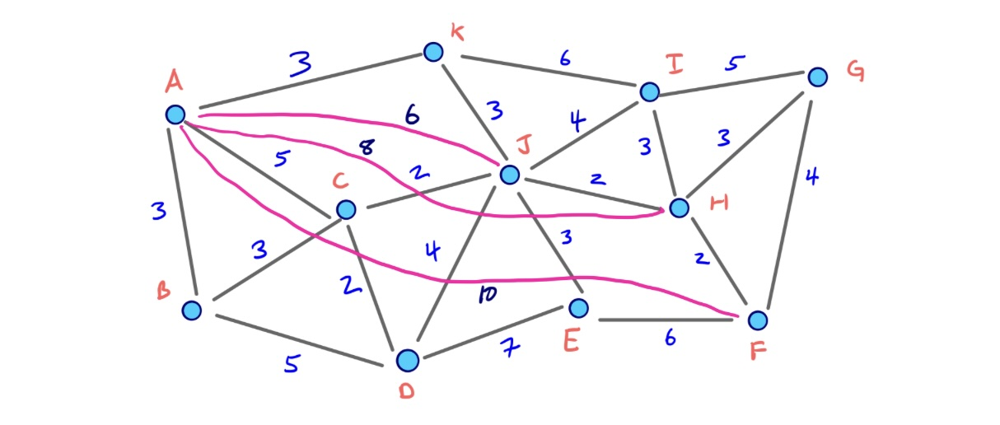
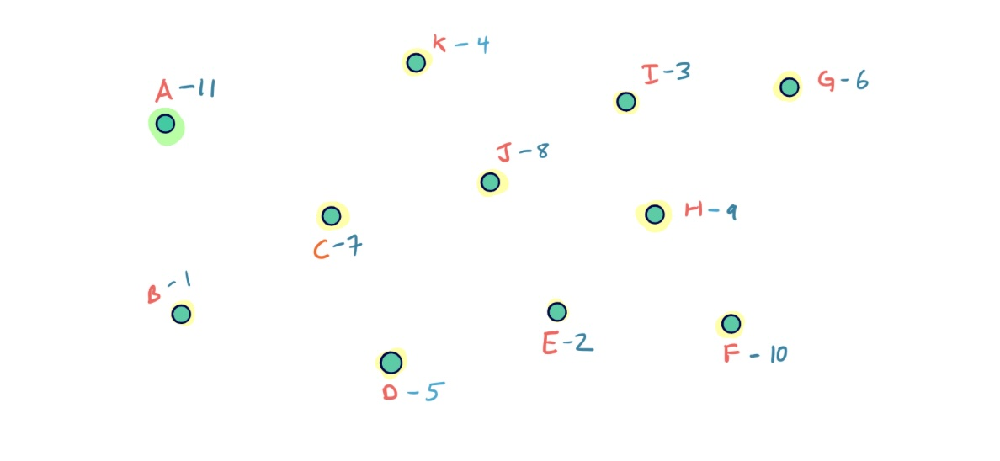
2. **收缩节点 v** 的过程（contraction(v)）：  
   - 对每对入邻 u（u→v）和出邻 w（v→w）执行一次“**witness search**”：在当前图中搜索从 u 到 w 的最短距离，限制搜索深度或**代价上界为 dist(u,v)+dist(v,w)=L**。（你可以理解为在进行Bidirectional Dijkstra 搜索时如果存在$w(u,k)>L$则$w(u,k)+w(k,w)>L$可以不用再探索这一条路径）  
   - 如果 witness search 找到的替代路径的代价 ≤ dist(u,v)+dist(v,w)，则说明**不需要添加 shortcut**（**存在不通过 v 的等价或更短路径**）。否则，说明u,w之间**不存在不经过v的最短路径**，**插入 shortcut 边 u→w**，权重 = dist(u,v)+dist(v,w)，并记录该 shortcut 为来自 v（便于路径展开）。  
   - 标记 v 为已收缩，记录 **v 的层级**（收缩时间戳或 rank）。  
   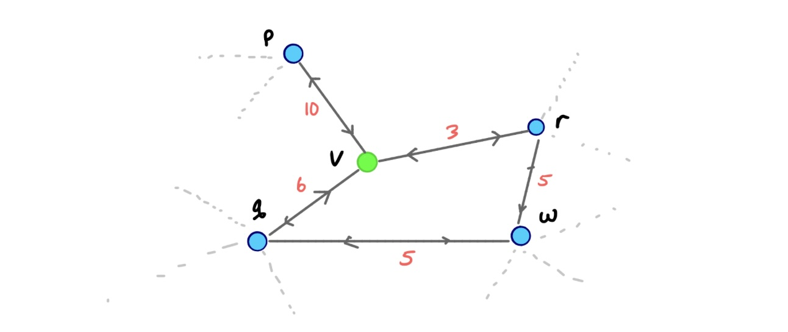
   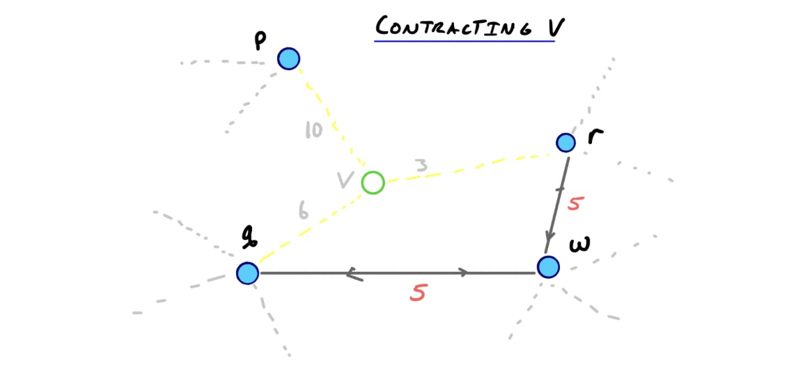
   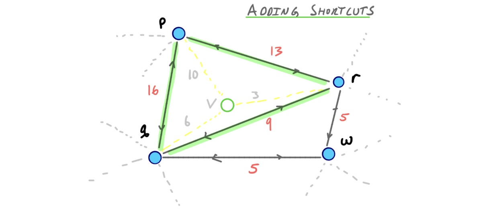
3. 对所有结点进行**重复收缩**。最终图包含原始边和大量 shortcuts，并且每条边都可以带有“产生者”或“中间节点”信息（用于路径还原）。注意这个我们在查询两个结点的最短路径路径时不会在最终图运行Dijkstra,而是在**Upward Graph**上，这个图里面的每条边上的两个点都是**从层级低指向高**，所有Upward Graph是一个有向无环图
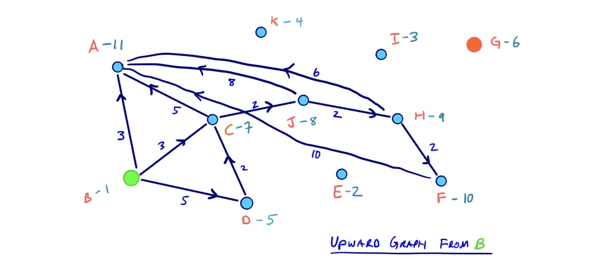
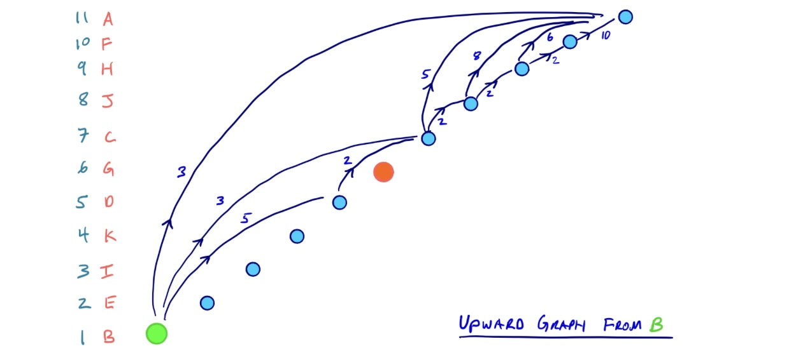
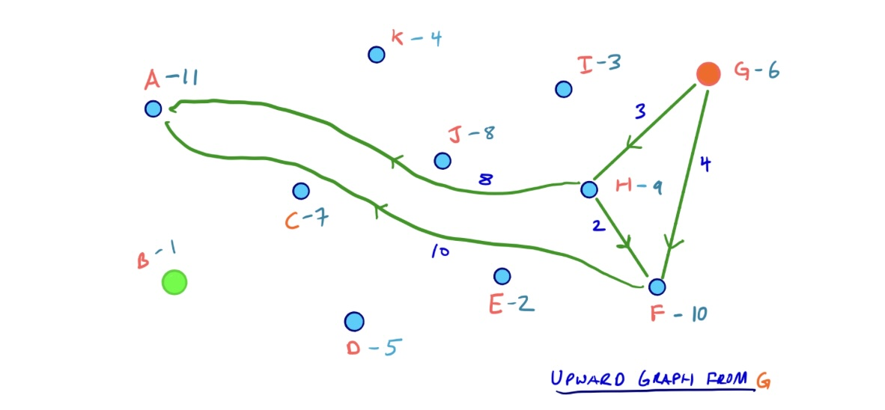
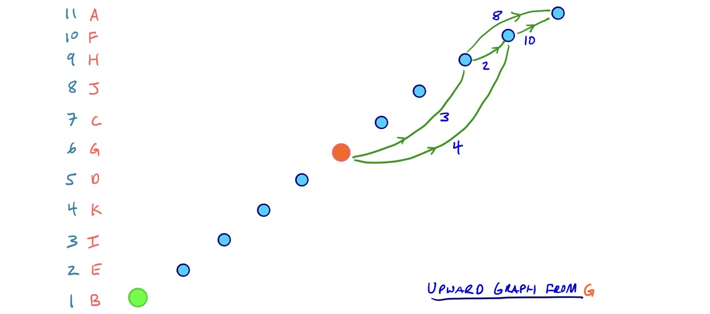
4. **Path unpacking**：生成 shortcut 时同时保留它所代表的中间节点（通常是 v），用于在查询后递归展开 shortcut 以恢复原始顶点序列。
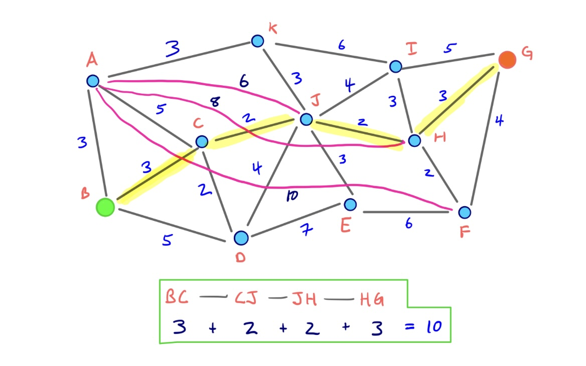
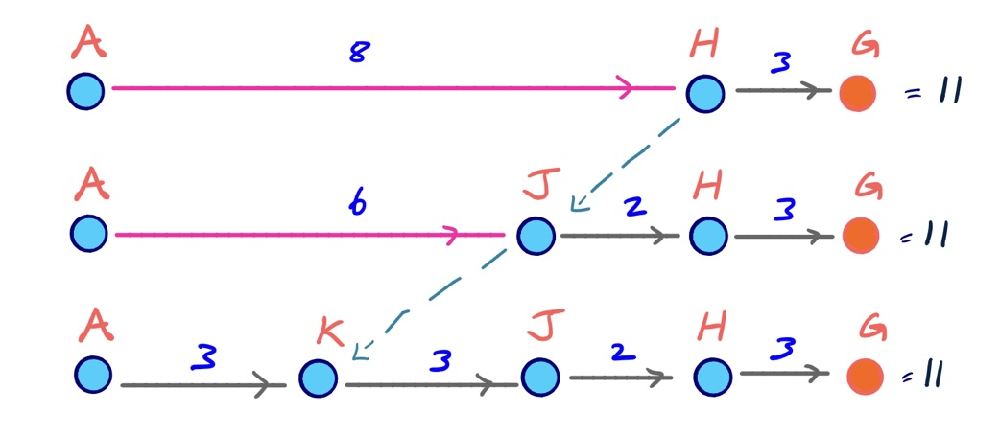
#### 查询（在线）——详细步骤
1. 输入 s, t。准备两张数组 distF/distB（初始化为 +∞），和两个优先队列 QF（正向）、QB（反向）。  
2. 将 distF[s]=0, push (0,s) 到 QF；将 distB[t]=0, push (0,t) 到 QB。best=+∞。  
3. 正/反向交替或按队头键值较小者扩展（和双向 Dijkstra 类似），但只允许沿“向上边”扩展：一条有向边 x→y 仅在 rank(x) < rank(y) 时被视为“向上”；因此正向扩展考察所有从 u 出发且 rank(u) < rank(v) 的边，反向扩展在反图上同理。  
4. 每当某个节点 v 被两边都访问到（两边 dist 不为 +∞），更新候选 best = min(best, distF[v]+distB[v])。  
5. 停止条件与双向 Dijkstra 一样：当 minKey(QF) + minKey(QB) ≥ best 时停止。返回 best 和通过记录的 parentF/parentB 以及 shortcut unpacking 还原完整路径。

#### 路径还原（unpacking） 
- 查询得到 meet 节点 m（或多个可能的交汇点，选使 distF+distB 最小者）；从 s 到 m 的路径与从 t 到 m（反向） 的路径都可能包含 shortcut，递归将每条 shortcut 替换成其生成时记录的中间节点分割的两条边，直到只剩原始边为止，从而重建完整顶点序列。

#### 正确性证明
目的：证明在收缩并添加了 shortcuts 后，按 rank 单调上升的最短路径存在且在线查询会找到全局最短路。

证明思路分几个引理：

引理 1（收缩时 shortcut 保全最短路）：  
- 当在收缩节点 v 时，对于任一入边 u→v 与出边 v→w，如果存在一条不经过 v 的路径 u→…→w 的长度 ≤ dist(u,v)+dist(v,w)，则 witness search 会发现该路径（或等价），不插入 shortcut；若不存在这样的路径，则插入 shortcut u→w，使得在收缩后的图中仍存在从 u 到 w 的一条长度等于原最短通过 v 的路径。  
- 因此，对于任一被 v 参与的最短路径断点 u→v→w，在收缩后图中仍有至少一条等长路径连接 u 与 w（直接为 shortcut 或原路径仍存在）。**由此收缩不会丢失任一原最短路径的长度信息。**

引理 2（存在单调路径）：  
- 对原图中任一最短路径 P = s = x0 → x1 → … → xk = t，考虑收缩顺序（每个节点有一个 rank）。把 P 上节点按**收缩时间排序**（rank），在逐步收缩所有节点后，可构造一条路径 P' 在收缩图中，其经过节点满足 rank 单调递增（或非递减），并且长度与 P 相同。（证明：递归地用 shortcut 替代每个被收缩的内部节点；由引理1，替换保持等长，最终得到只沿向上边行走的路径。）  
- 因此任何原图最短路径都**有等长的“单调（upward）”替代路径存在于 CH 图**

引理 3（查询能找到单调最短路径）：  
- **查询算法仅在向上边上进行正/反向搜索**，等价于只在单调路径空间中寻找路径。由引理2，存在一条等长的单调最短路径 P'，因此查询不会错过最短距离值。当正/反向搜索的相遇点满足 distF+distB = length(P') 时，best 会被更新为真实最短值。**停止条件保证最终得到的 best 是全局最短距离**（和双向 Dijkstra 的证明类似）。
#### 局限
当然Contraction Hierarchies也有自己的局限，因为预处理需要进行大量单源最短路径查询，所以当这个算法被应用在结点和边数都很庞大的图上（比如某个国家的道路网或者国际道路网）时，就需要大量时间。因此，一般的现代导航工具会提前对每个结点进行收缩，等到用户实际查询两结点间最短路径时再在Upward Graph上运行Bidirectional Dijkstra，此时由于Upward Graph相比原来的图，由于添加了shortcuts,大大减少了查询过程中经过的结点和边。但是，一旦出现了道路封锁和交通事故等等原因，导致图中边或者结点的变动，Contraction Hierarchies很可能返回错误的最短路径（如果还要坚持用Contraction Hierarchies求得最优路径的话，就需要重新预处理这样的开销太大了）